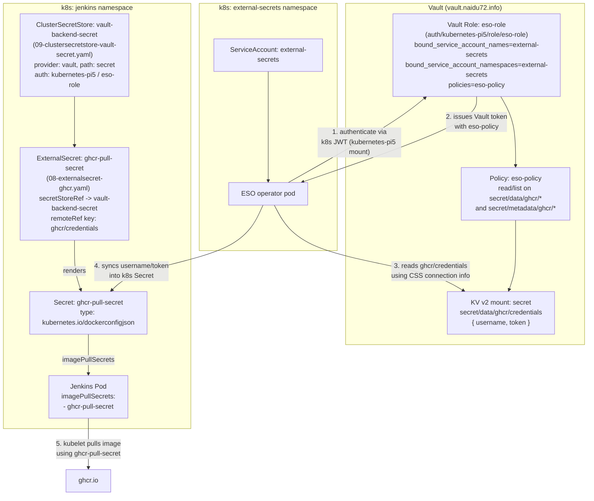

# External Secrets (ESO) → Vault → GHCR Pull Secret

How Jenkins authenticates to `ghcr.io` to pull `ghcr.io/naidu72/jenkins:lts`,
using External Secrets Operator (ESO) to sync credentials from Vault into a
Kubernetes `dockerconfigjson` Secret.

## Diagram

## Step-by-step

1. **Vault holds the credentials**
   `secret/data/ghcr/credentials` (KV v2, mount `secret`) contains:
   - `username` — GHCR username (`naidu72`)
   - `token` — GitHub PAT with `read:packages` scope

2. **Vault policy `eso-policy`**
   Grants `read`/`list` on `secret/data/ghcr/*` and `secret/metadata/ghcr/*`
   (in addition to the original `kv/data/apps/*`, `kv/data/ssh/*`,
   `kv/data/homelab/*`, `kv/metadata/*` rules).

3. **Vault role `eso-role`** (under the `kubernetes-pi5` auth mount)
   Binds the k8s identity to the policy:
   - Only the `external-secrets` ServiceAccount in the `external-secrets`
     namespace can assume this role.
   - Successful auth issues a Vault token carrying `eso-policy`.

4. **ClusterSecretStore `vault-backend-secret`**
   ([09-clustersecretstore-vault-secret.yaml](base/09-clustersecretstore-vault-secret.yaml))
   Tells ESO *how* to reach Vault: server URL, KV mount (`secret`), and the
   `kubernetes-pi5` / `eso-role` auth config. Cluster-scoped, so any
   namespace's `ExternalSecret` can reference it.

5. **ExternalSecret `ghcr-pull-secret`**
   ([08-externalsecret-ghcr.yaml](base/08-externalsecret-ghcr.yaml))
   References the ClusterSecretStore, pulls `username`/`token` from
   `ghcr/credentials`, and renders a `kubernetes.io/dockerconfigjson` Secret
   named `ghcr-pull-secret` in the `jenkins` namespace. Refreshed hourly.

6. **Jenkins Pod**
   ([03-deployment.yaml](base/03-deployment.yaml)) references
   `imagePullSecrets: [{name: ghcr-pull-secret}]`, so kubelet uses it to
   authenticate the `ghcr.io/naidu72/jenkins:lts` image pull.

## Key takeaway: two independent identities

- **`external-secrets` SA** (namespace `external-secrets`) — used only by the
  ESO operator to authenticate to Vault and produce the `ghcr-pull-secret`
  Secret.
- **`jenkins` SA** (namespace `jenkins`) — used by the Jenkins pod itself for
  in-cluster k8s API access (e.g. the JCasC Kubernetes cloud plugin spawning
  agent pods). It plays **no role** in fetching or using
  `ghcr-pull-secret` — that's purely a kubelet + pod-spec mechanism.
